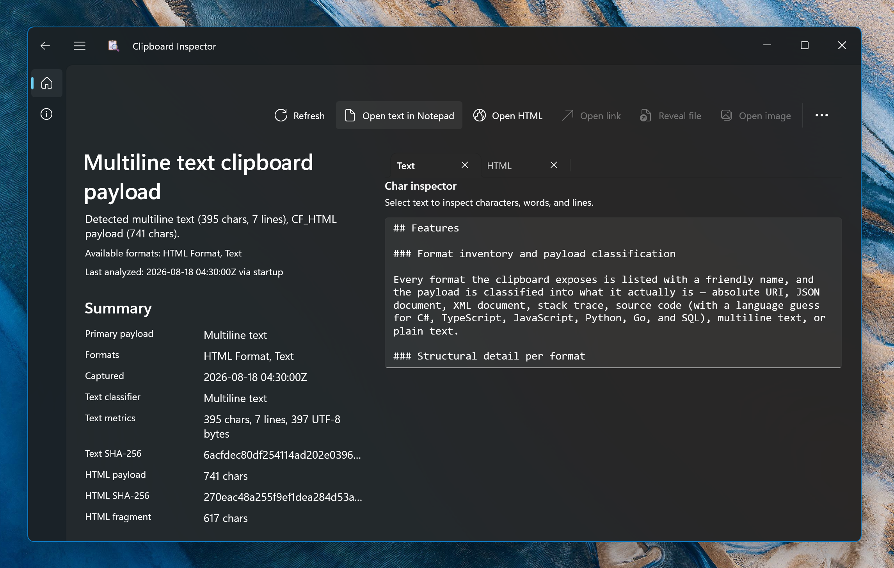

<p align="center">
  
</p>
<h1 align="center">
  Clipboard Inspector
</h1>
<p align="center">
  See exactly what is on your clipboard.
</p>

<p align="center">
  
</p>

## Overview

Clipboard Inspector is a developer-focused Windows app for examining the current clipboard in technical detail. Copying looks simple, but a single copy usually puts several formats on the clipboard at once — plain text, CF_HTML with its offset header, RTF, a bitmap, file paths, a URL — and the app that pastes decides which one it takes. Clipboard Inspector shows you all of them.

Open the app and it analyzes the clipboard immediately. While the window stays open it listens for clipboard changes and re-analyzes in place, so you can copy from another app and watch the results update without touching the inspector.

## Features

### Format inventory and payload classification

Every format the clipboard exposes is listed with a friendly name, and the payload is classified into what it actually is — absolute URI, JSON document, XML document, stack trace, source code (with a language guess for C#, TypeScript, JavaScript, Python, Go, and SQL), multiline text, or plain text.

### Structural detail per format

- **Text** — character, line, and UTF-8 byte counts plus a SHA-256 hash of the payload.
- **JSON** — root kind, top-level property or item counts, and sample keys.
- **XML** — root element name and descendant element count.
- **Stack traces** — the exception line and the top frame pulled out of the noise.
- **Source code** — namespace/import, type declaration, and member counts.
- **HTML** — the raw CF_HTML payload including its header, with the document title, `SourceURL`, and `StartFragment`/`EndFragment` length decoded from the offsets.
- **RTF** — the raw RTF source and its hash.
- **Images** — dimensions, pixel format, alpha mode, SHA-256 of the pixel data, and a live preview.
- **Files** — every dropped file or folder with kind, size, and full path.

### Character inspector

Select text in the Text tab and the app reports characters, words, and lines for the selection. Select a single character and it resolves the Unicode code point and official name via ICU, with dedicated descriptions for control characters (`U+0009 Horizontal tab (HT / Ctrl-I, dec 9, oct 011)`) so invisible payload contents stop being a mystery.

### Session history

The most recent 25 distinct clipboard payloads are kept so you can step back through what you copied and re-inspect an earlier snapshot. History lives in memory only and is cleared when the app closes — nothing is written to disk.

### Contextual actions

The command bar enables only the actions the current payload supports:

- Open the plain text in Notepad
- Open the raw CF_HTML payload in a temporary file
- Launch a detected URI with its default handler
- Reveal the first file-drop item in Explorer
- Export the bitmap as a PNG and open it in the default image viewer

Exported files are written to a `ClipboardInspector` folder under the system temp directory.

## Privacy

Clipboard contents are analyzed in memory and never leave your machine. Session history is in-memory only and cleared on close. The only files the app writes are the temporary exports you explicitly request through the action buttons.

## Built with

- [WinUI 3](https://learn.microsoft.com/windows/apps/winui/winui3/) and the [Windows App SDK](https://learn.microsoft.com/windows/apps/windows-app-sdk/) 1.8
- .NET 10 (`net10.0-windows10.0.26100.0`), x64 and ARM64
- [CommunityToolkit.Mvvm](https://learn.microsoft.com/dotnet/communitytoolkit/mvvm/) for the MVVM plumbing
- Packaged as an MSIX with single-project MSIX tooling

## Building

Requires the .NET 10 SDK and the Windows App SDK workload. Windows 10 version 1809 (build 17763) or newer.

```powershell
git clone https://github.com/TheJoeFin/clipboard-inspector.git
cd clipboard-inspector
dotnet build clipboard-inspector.slnx
```

Or open `clipboard-inspector.slnx` in Visual Studio 2022 and press F5.

## Project layout

| Path | Purpose |
| --- | --- |
| `Services/ClipboardInspectionService.cs` | Reads the clipboard and produces the full inspection result |
| `Services/ExternalContentLauncher.cs` | Writes temporary exports and launches external apps |
| `ViewModels/HomePageViewModel.cs` | Refresh coordination, session history, and action commands |
| `Pages/HomePage.xaml` | Overview panel, detail tabs, and the character inspector |
| `Models/ClipboardInspectionModels.cs` | Records describing an inspected clipboard payload |

## License

[MIT](LICENSE.txt)
